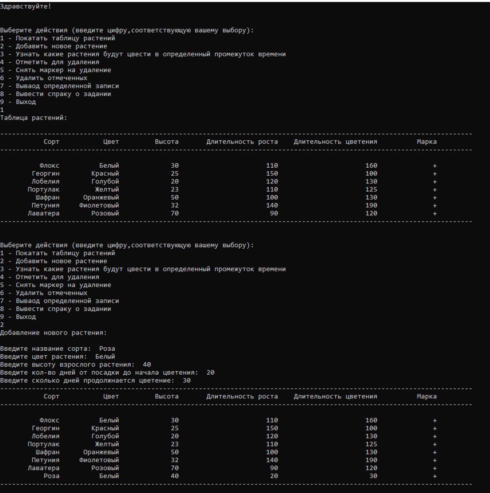
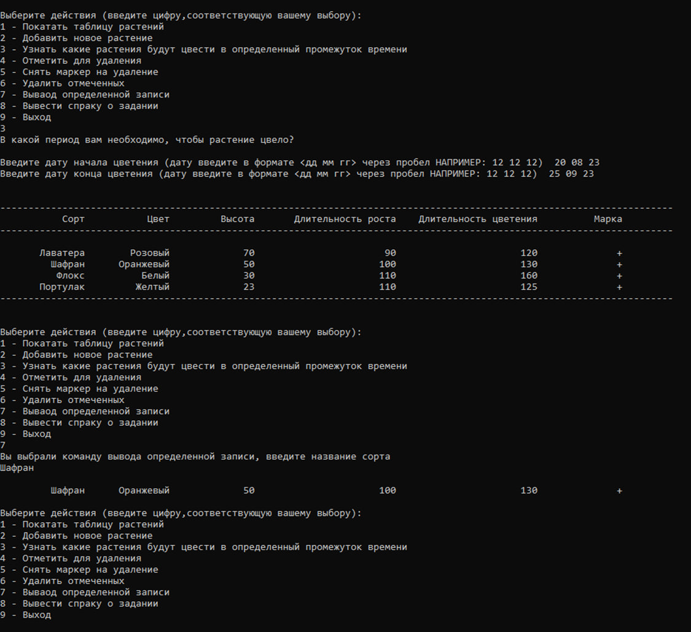
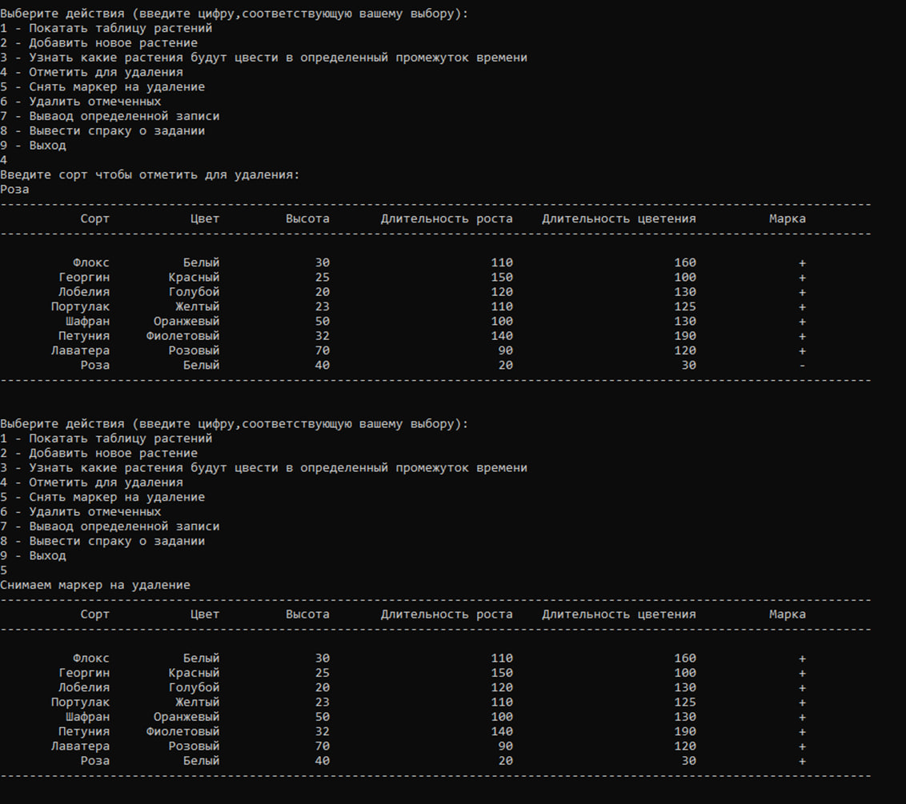
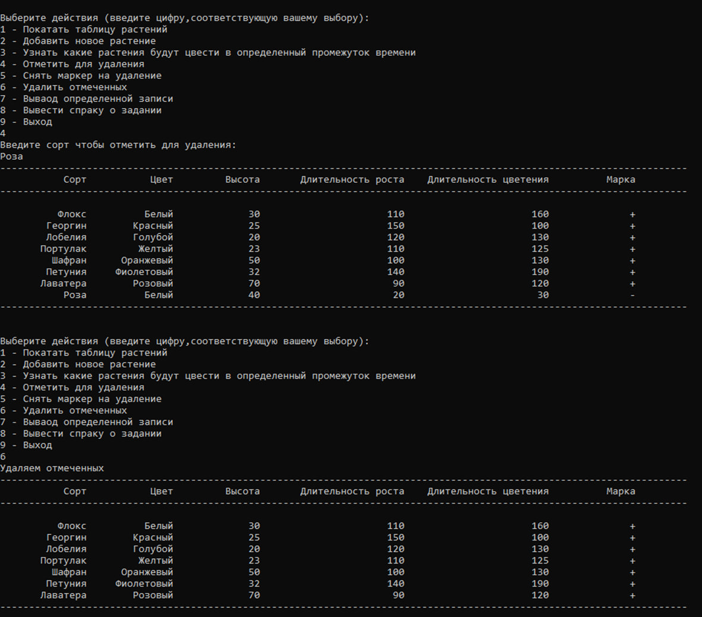
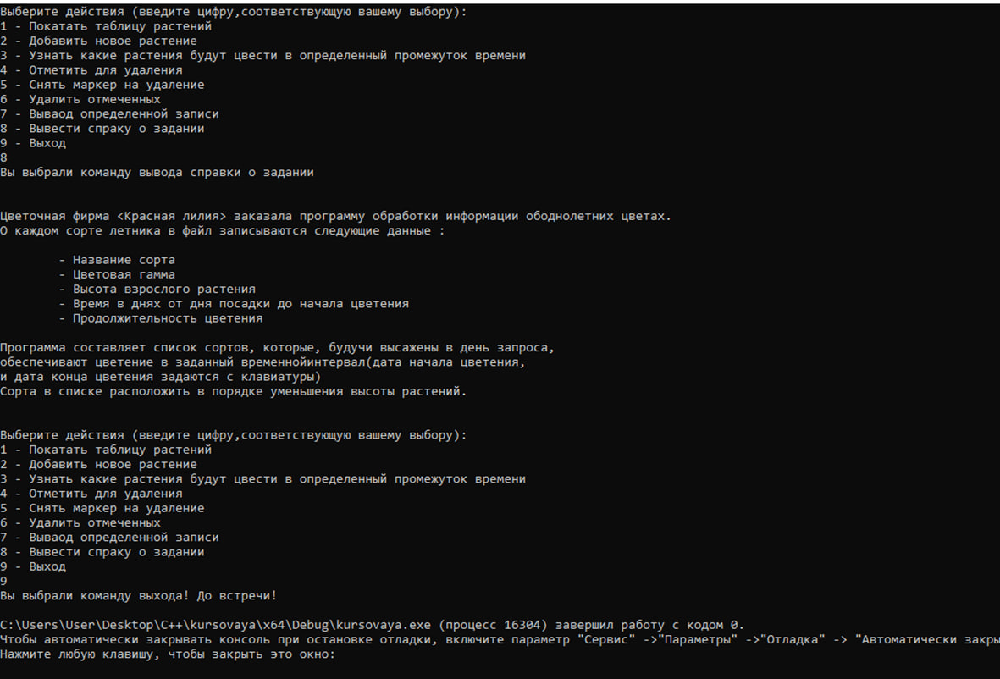

# Flower Firm "Red Lily" — Program for Processing Plant Information
### Studying at university (spring 2021)

This project is a program for managing information about plants used by a flower firm. It allows adding new plants, displaying existing ones, and finding plants that will bloom within a specified time period.

## Description

The flower firm "Red Lily" commissioned this program to process information about annual flowers. For each type of annual flower, the following data is recorded in a file:
- Variety name
- Color range
- Height of the mature plant
- Time in days from planting to the start of blooming
- Duration of blooming

The program generates a list of varieties that, when planted on the day of the request, will ensure blooming within the specified time interval (start and end bloom dates are input by the user). The varieties in the list are sorted in descending order of plant height.

## How to run

1. **Development environment**: It is recommended to run this project in **Microsoft Visual Studio**, as it is fully compatible with this environment.

2. **Running the project**:
   - Open the project in Visual Studio.
   - Build and run the project from the IDE.

## Requirements

- **Operating system**: This project uses the `windows.h` library, so it is designed to run only on Windows operating systems.

## Project files

- **`header.h`**: Contains definitions of structures, functions, and external variables.
- **`function.cpp`**: Implementation of functions for handling plant data.
- **`kursovaya.cpp`**: Main file with the `main` function controlling the program flow.
- **`vvod-vivod.cpp`**: Functions for formatted output of data.

## Debugging notes

- For debugging purposes, you can modify the `now_date` variable in the `print_res_bloom` function.
  - **Current version**: `int now_date = perevod_dat(array_now_date);`
  - **For debugging**: Comment out the line above and uncomment `int now_date = 145;`

## Screenshots

